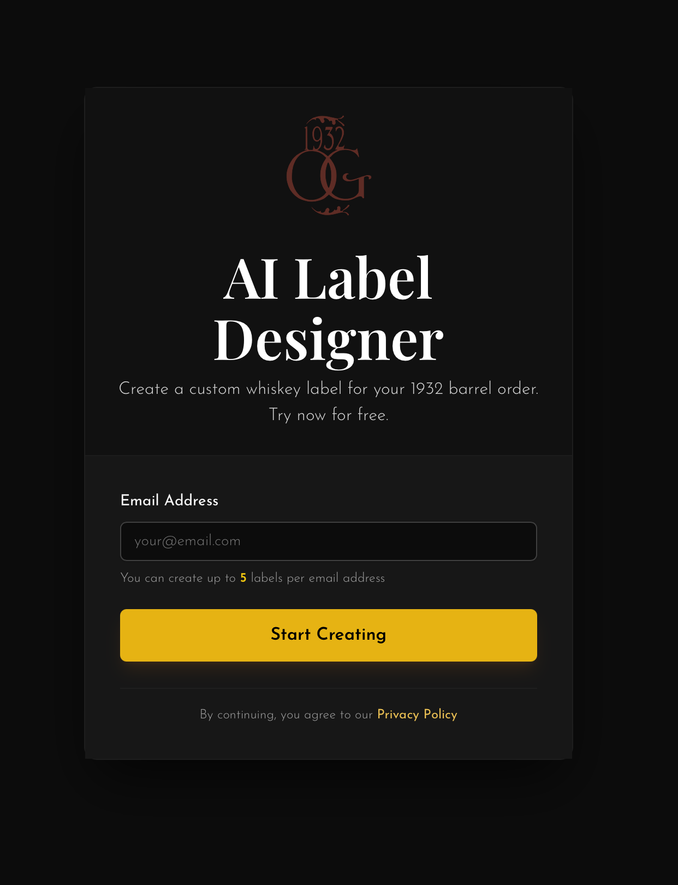
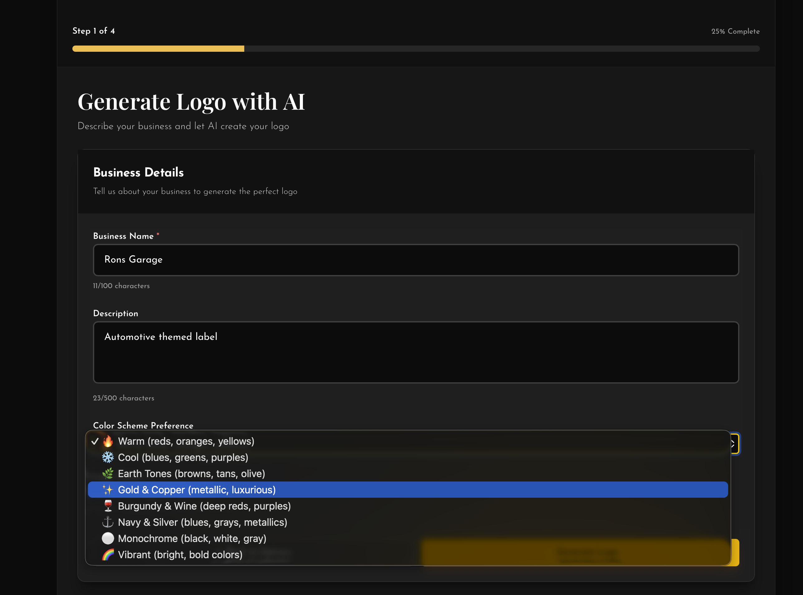
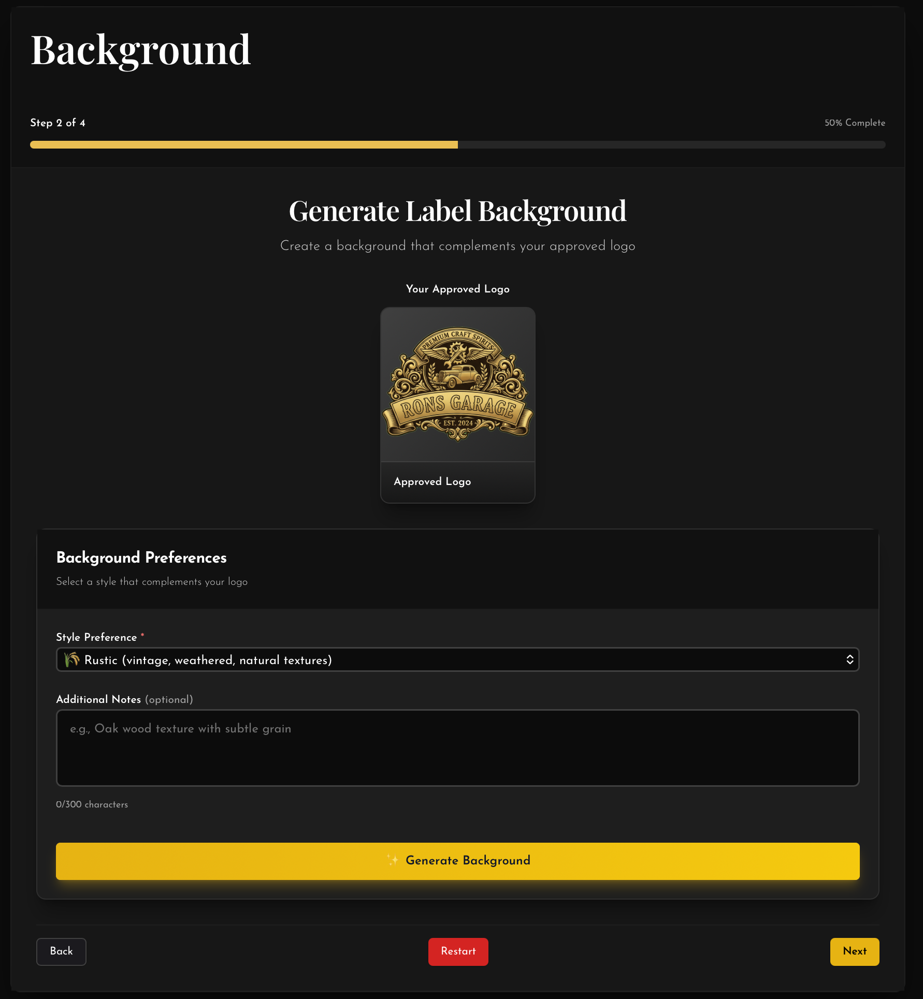
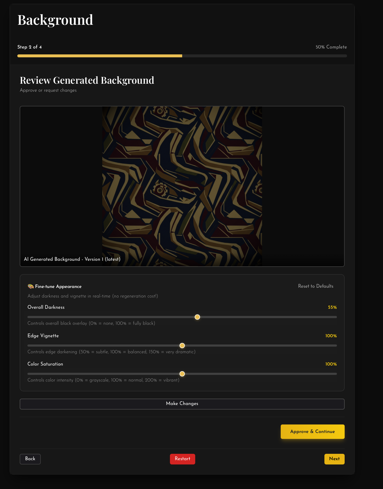
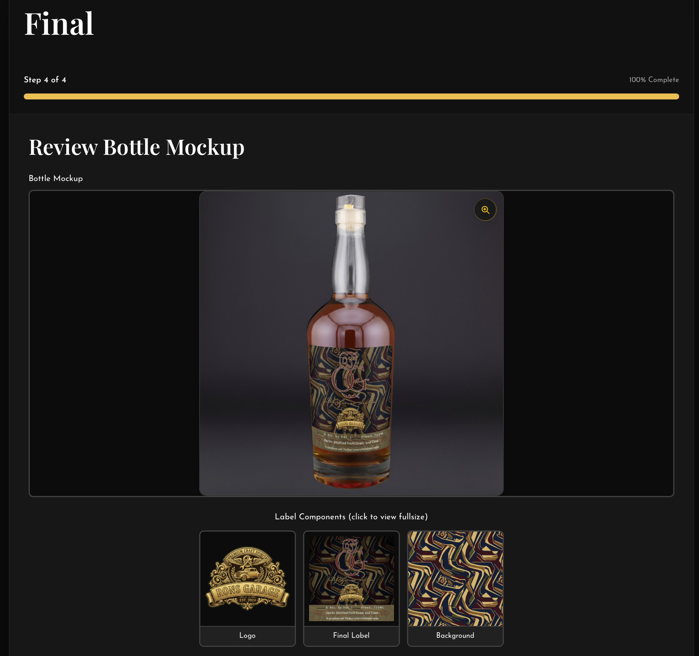
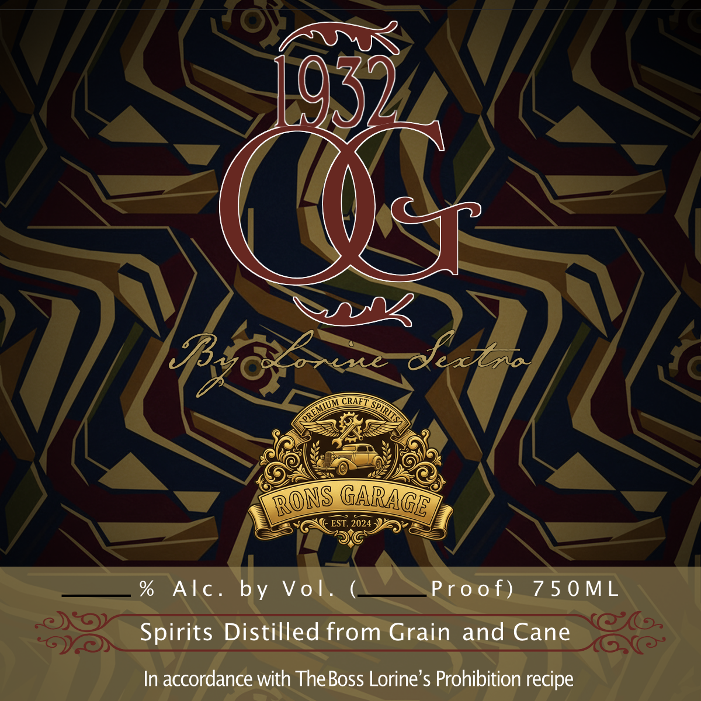
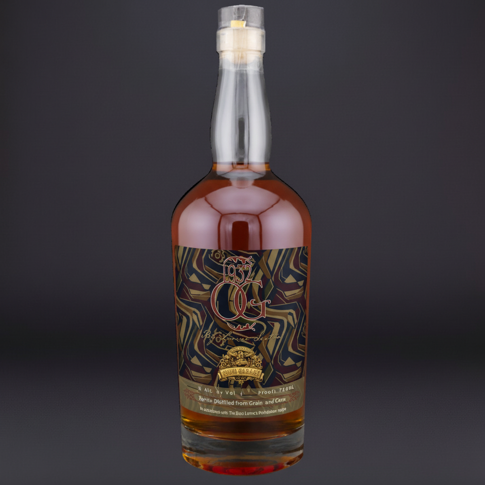

   

# AI-Powered Custom Label Design — From Text to Photorealistic Mockup

**[Live Demo](https://labelwizard.702market.com/)** · **[Full Repository](https://github.com/702ron/1932-label-wizard)**

Full-stack whiskey barrel label creator that turns simple text input into photorealistic bottle mockups. A 4-step wizard handles logo generation, background creation, real-time fine-tuning, and final mockup rendering — no design skills needed.

[](https://labelwizard.702market.com/)

## What I Built

- **4-Step Guided Wizard** — Barrel details → AI logo generation → dynamic background creation → photorealistic bottle mockup
- **AI Image Generation** — OpenRouter and Google Gemini create custom logos and contextual backgrounds from text descriptions
- **Real-Time Fine-Tuning** — Instant regeneration and parameter adjustments without backend delays, sub-5s generation via Redis caching
- **Production Storage** — MinIO object storage + PostgreSQL metadata for scalable image handling
- **Docker Deployment** — Full-stack local + cloud deployment with Docker Compose

## Screenshots

| Logo Generation | Background Creation |
|:-:|:-:|
| [](./screenshots/02-logo-generation.png) | [](./screenshots/03-background-generation.png) |

| Fine-Tuning | Final Mockup |
|:-:|:-:|
| [](./screenshots/04-background-tuning.png) | [](./screenshots/05-final-mockup.png) |

| Label Output | Bottle Mockup |
|:-:|:-:|
| [](./screenshots/06-label-output.png) | [](./screenshots/07-bottle-mockup.png) |

## Architecture

```
User Input (4-Step Form)
         ↓
   React Frontend
         ↓
   FastAPI Coordinator
         ↓
    ┌────┴────┬─────────┬──────────┐
    ↓         ↓         ↓          ↓
  Redis   PostgreSQL  MinIO   OpenRouter/
 (Cache)  (Metadata) (Storage)  Gemini (AI)
```

## Results

- **Sub-5-second generation** via Redis caching and intelligent request batching
- **7 screenshots** documenting every step of the wizard flow
- **Live production deployment** at labelwizard.702market.com
- **Full-stack Docker Compose** — one command to run frontend, backend, and all services

## Tech Stack

React, FastAPI, TypeScript, Python, OpenRouter, Google Gemini, Redis, PostgreSQL, MinIO, Docker Compose

---

Built by [Ron](https://github.com/702ron)
