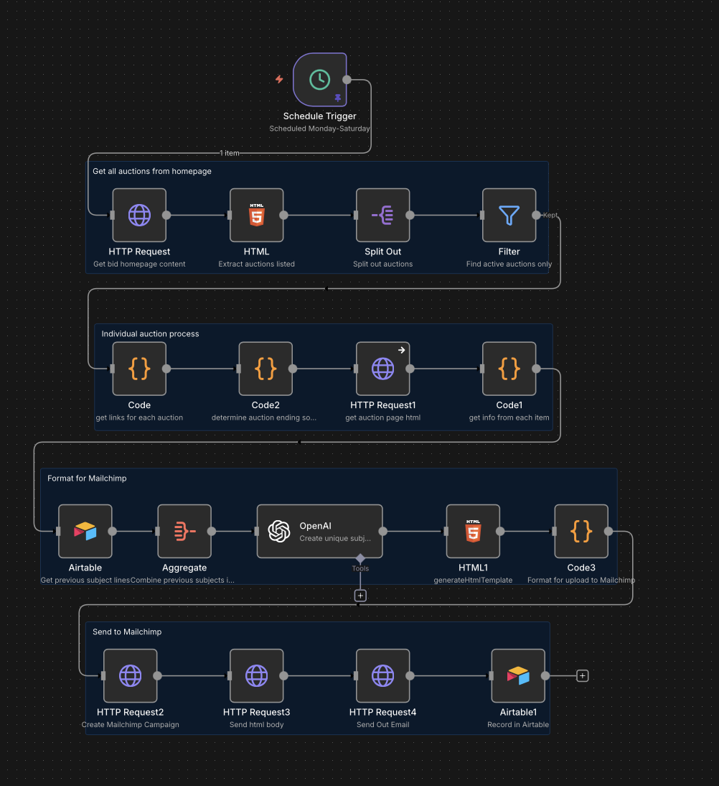
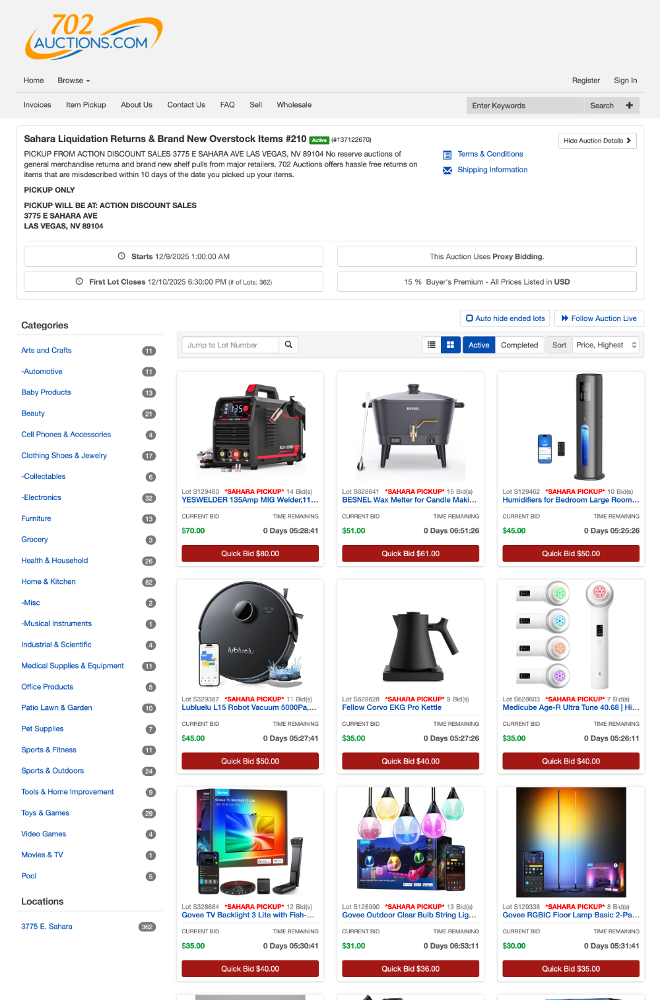

   

# Automated Email Merchandising — Trending Products to Inbox

**[Full Repository](https://github.com/702ron/auction-email-automation)**

Cron-driven email automation that fetches trending inventory from Airtable, applies selection logic and deduplication, fills responsive MJML templates, and delivers via Mailchimp with UTM tracking and dry-run previews.



## What I Built

- **Scheduled Cron Execution** — Runs on custom intervals without manual triggering
- **Intelligent Item Selection** — Configurable filters by price, category, stock level, and popularity
- **Smart Deduplication** — Prevents same products in consecutive campaigns; maintains recipient fatigue thresholds
- **Responsive MJML Templates** — Mobile-perfect emails with auto-populated images, pricing, and CTAs
- **UTM Analytics** — Auto-generated campaign/source/medium parameters for ROI attribution
- **Dry-Run Preview** — Test emails before sending to live audience

## Screenshots

| Generated Email | Website Integration |
|:-:|:-:|
| [](./screenshots/generated%20email.png) | [](./screenshots/website_screenshot.png) |

## Architecture

```
Cron Trigger (Scheduled)
        ↓
  Airtable Inventory Query
        ↓
  Selection Rules + Deduplication
        ↓
    ┌───┴───┬──────────┐
    ↓       ↓          ↓
  MJML    Dry-Run   Mailchimp
 Template  Preview   Delivery
```

## Results

- **Fully automated** — no manual campaign creation or product selection
- **Mobile-responsive** MJML templates render perfectly across all clients
- **UTM tracking** for precise campaign-level ROI attribution in Google Analytics
- **Deduplication** prevents subscriber fatigue and maintains list health

## Tech Stack

n8n, Airtable API, MJML, Mailchimp API, Cron

---

Built by [Ron](https://github.com/702ron)
