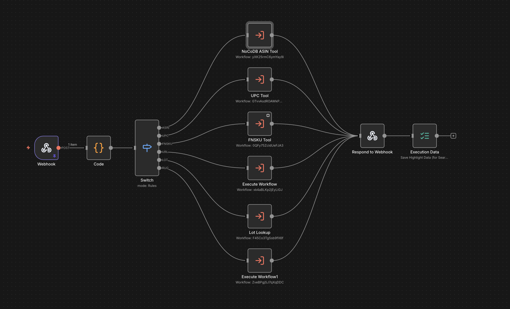
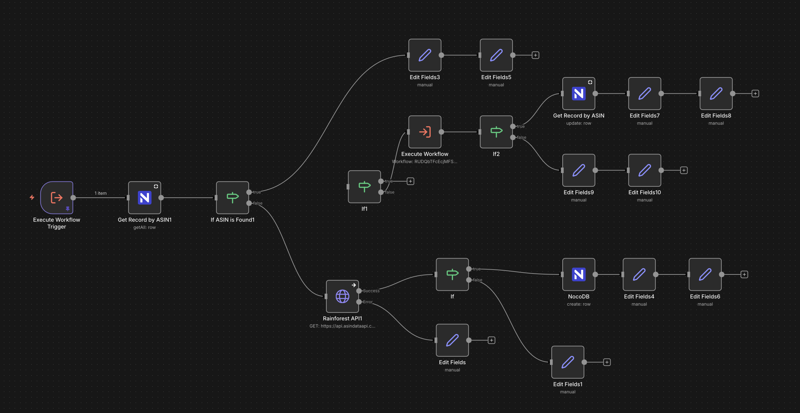
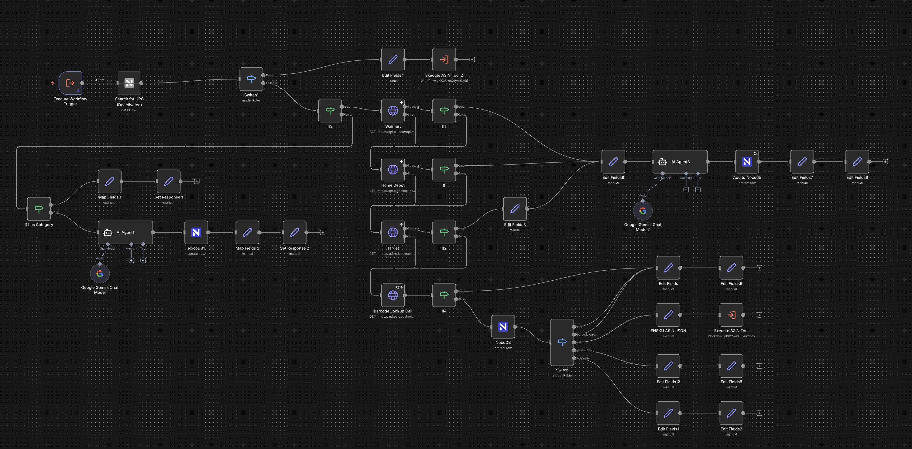
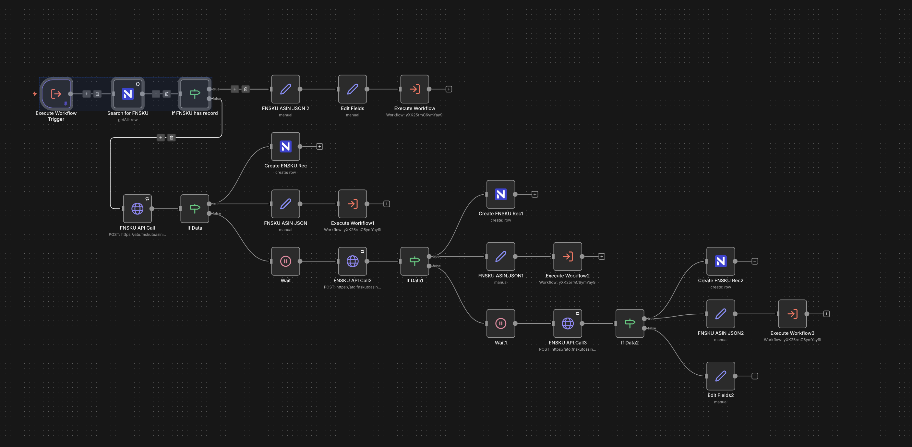
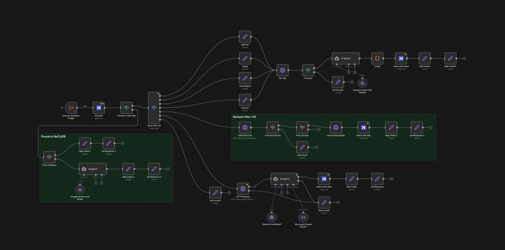
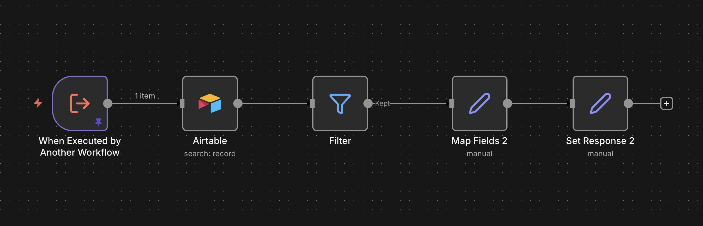
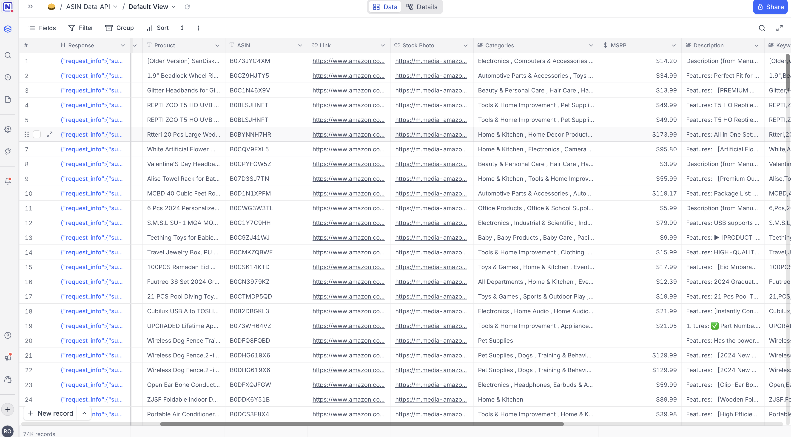

   

# Universal Product Lookup Across 4 Retailers — Any Identifier, Instant Data

**[Full Repository](https://github.com/702ron/product-info-lookup)**

Universal product data API that accepts any identifier — ASIN, UPC, FNSKU, URL, or LOT number — and retrieves structured information from Amazon, Walmart, Target, and Home Depot. Intelligent fallback handling, AI categorization, and smart caching ensure sub-2-second lookups.

[](./screenshots/main-workflow.png)

## What I Built

- **Universal Identifier Detection** — Auto-detects ASIN, UPC, FNSKU, product URLs, or LOT numbers without manual specification
- **4-Retailer Parallel Queries** — Amazon, Walmart, Target, Home Depot queried simultaneously for best coverage
- **AI Categorization** — Google Gemini and GPT-4 assign structured product categories autonomously
- **NocoDB Smart Caching** — TTL-based cache eliminates redundant API calls; cached queries return in milliseconds
- **Firecrawl Fallback** — Scraping layer kicks in when API access is limited

## Screenshots

| ASIN Tool Workflow | UPC Tool Workflow |
|:-:|:-:|
| [](./screenshots/asin-tool-workflow.png) | [](./screenshots/upc-tool-workflow.png) |

| FNSKU Tool Workflow | URL Tool Workflow |
|:-:|:-:|
| [](./screenshots/fnsku-tool-workflow.png) | [](./screenshots/url-tool-workflow.png) |

| Lot Lookup Workflow | NocoDB Cache Table |
|:-:|:-:|
| [](./screenshots/lot-lookup-workflow.png) | [](./screenshots/nocodb-cache-table.png) |

## Architecture

```
Product Identifier Input
        ↓
  Auto-Detect Type (ASIN/UPC/FNSKU/URL/LOT)
        ↓
    ┌───┴────┬────────┬────────┬──────────┐
    ↓        ↓        ↓        ↓          ↓
  Amazon   Walmart   Target   Home Depot  Firecrawl
    └────────┴────────┴────────┴──────────┘
                     ↓
           NocoDB Cache → AI Categorization → Structured JSON
```

## Results

- **Sub-2-second lookups** for fresh data; milliseconds for cached
- **5 identifier types** auto-detected and routed
- **4 major retailers** queried in parallel per request
- **AI categorization** via Gemini + GPT-4 without manual tagging
- **7 workflow screenshots** documenting every tool and integration

## Tech Stack

n8n, NocoDB, OpenAI GPT-4, Google Gemini, Firecrawl, Airtable, PostgreSQL

---

Built by [Ron](https://github.com/702ron)
