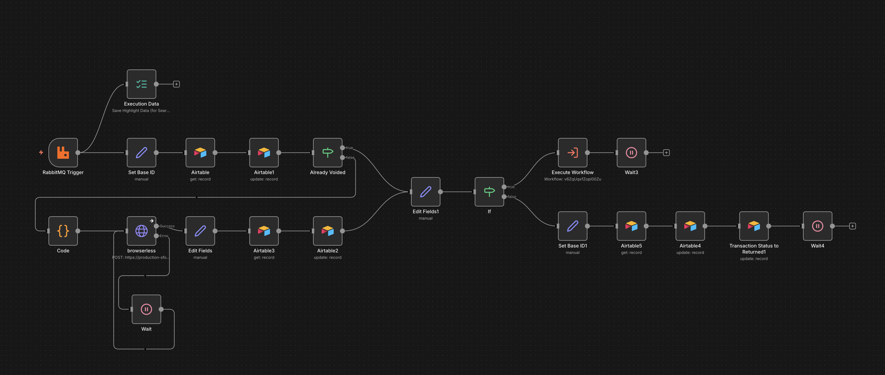
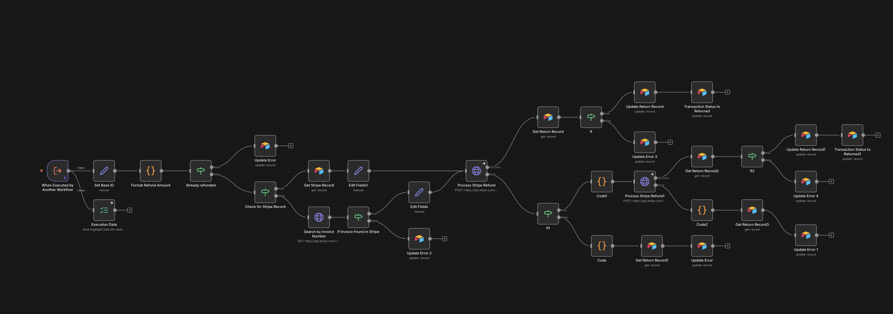
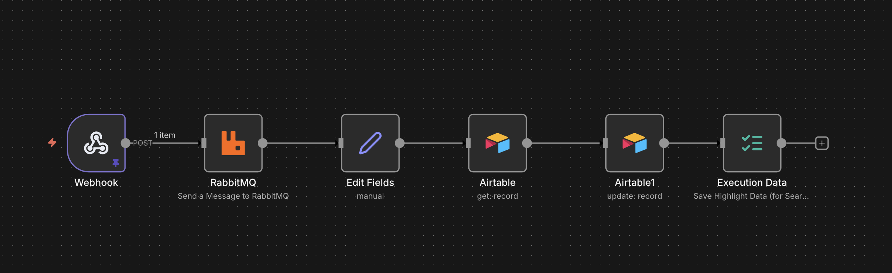
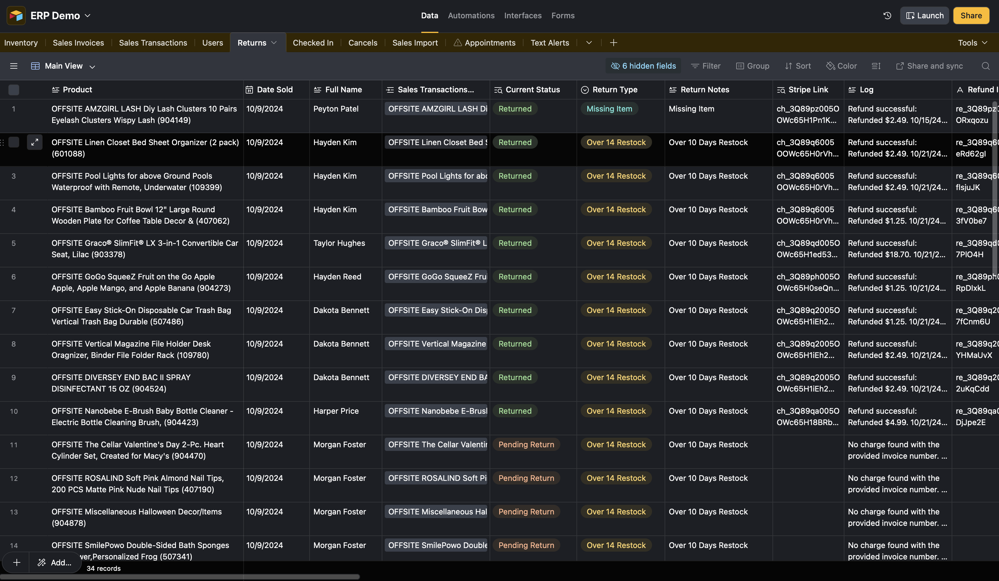

   

# Zero-Loss Refund Processing — 7 Steps, Fully Automated

**[Full Repository](https://github.com/702ron/refund-returns-processing)**

End-to-end returns automation: Airtable form → RabbitMQ queue → n8n orchestration → Browserless void → Stripe refund → immutable audit trail. Handles 6 return categories, multi-location inventory, and idempotent processing that guarantees no duplicate refunds.

[](./screenshots/void-on-bid-workflow.png)

## What I Built

- **RabbitMQ Queuing** — Reliable message queue ensures zero dropped requests with retry and replay
- **7-Step Pipeline** — Validation → Void (Browserless) → Inventory update → Stripe refund → Notify → Audit → Complete
- **Idempotent Design** — Safely reruns failed workflows without duplicate Stripe charges
- **6 Return Categories** — Warehouse returns, customer refunds, damaged goods + 3 custom categories with distinct logic
- **Multi-Location Support** — Routes to correct warehouse, adjusts regional inventory

## Screenshots

| Stripe Refund Workflow | RabbitMQ Queue Workflow |
|:-:|:-:|
| [](./screenshots/stripe-refund-workflow.png) | [](./screenshots/rabbitmq-queue-workflow.png) |

| Airtable Returns View |
|:-:|
| [](./screenshots/airtable-returns-view.png) |

## Architecture

```
Airtable Form Submission
        ↓
  RabbitMQ Queue
        ↓
  n8n Workflow Engine
        ↓
    ┌───┴───┬──────────┬──────────┬──────────┬────────┐
    ↓       ↓          ↓          ↓          ↓        ↓
Validate Browserless Inventory  Stripe   Email   PostgreSQL
         (Void)   Update      Refund   Notify    (Audit)
```

## Results

- **Zero lost transactions** via RabbitMQ message queuing
- **6 return categories** with distinct processing logic
- **Multi-location** inventory routing across warehouses
- **Idempotent refunds** — safe to retry without duplicates
- **Immutable audit trail** in PostgreSQL with full timestamps

## Tech Stack

n8n, RabbitMQ, Stripe API, Airtable, Browserless (Headless Chrome), PostgreSQL

---

Built by [Ron](https://github.com/702ron)
